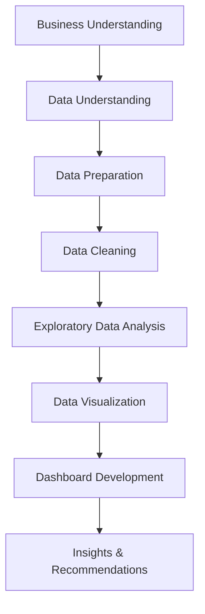

# 📊 Methodology Documentation
## Beijing Air Quality Data Analysis Project

---

## 📐 Analysis Framework

Proyek ini mengikuti **CRISP-DM (Cross-Industry Standard Process for Data Mining)** methodology yang telah disesuaikan untuk analisis data kualitas udara.



---

## 1️⃣ Business Understanding

### Research Questions

Analisis ini dirancang untuk menjawab **4 pertanyaan bisnis utama**:

1. **Daerah mana yang memiliki curah hujan tertinggi?**
   - Objective: Mengidentifikasi pola curah hujan spasial
   - Impact: Memahami natural cleansing factor untuk polusi

2. **Bagaimana kualitas udara tiap daerah?**
   - Objective: Comparative analysis kualitas udara antar stasiun
   - Impact: Identify pollution hotspots

3. **Bagaimana konsentrasi polutan terbesar di setiap daerah?**
   - Objective: Pollutant profiling per location
   - Impact: Source identification & mitigation strategies

4. **Bagaimana hubungan antara curah hujan dan tingkat polusi udara?**
   - Objective: Correlation analysis
   - Impact: Understand weather-pollution dynamics

---

## 2️⃣ Data Understanding

### Dataset Specifications

**Source**: PRSA Beijing Municipal Environmental Monitoring Center

| Attribute | Value |
|-----------|-------|
| **Time Period** | 1 Maret 2013 - 28 Februari 2017 (4 tahun) |
| **Granularity** | Hourly measurements |
| **Stations** | 12 monitoring stations |
| **Total Records** | ~420,768 observations (35,064 per station) |
| **Features** | 18 columns |

### Data Schema

```python
{
    'datetime': 'timestamp',      # Constructed from year, month, day, hour
    'station': 'object',          # Station name
    
    # Pollutants (μg/m³)
    'PM2.5': 'float64',           # Particulate Matter < 2.5μm
    'PM10': 'float64',            # Particulate Matter < 10μm
    'SO2': 'float64',             # Sulfur Dioxide
    'NO2': 'float64',             # Nitrogen Dioxide
    'CO': 'float64',              # Carbon Monoxide
    'O3': 'float64',              # Ozone
    
    # Weather Parameters
    'TEMP': 'float64',            # Temperature (°C)
    'PRES': 'float64',            # Pressure (hPa)
    'DEWP': 'float64',            # Dew Point (°C)
    'RAIN': 'float64',            # Rainfall (mm)
    'wd': 'object',               # Wind Direction
    'WSPM': 'float64',            # Wind Speed (m/s)
}
```

### Initial Data Quality Assessment

```python
# Sample assessment code
duplicate_check = df.duplicated().sum()  # Result: 0 duplicates

# Data type validation
dtype_verification = df.dtypes.apply(lambda x: x.name).to_dict()

# Missing values analysis
missing_stats = df.isna().sum()
```

**Findings**:
- ✅ **No duplicate records** - Data integrity maintained
- ✅ **Consistent data types** - All numerical/categorical appropriate
- ⚠️ **Missing values detected** - Ranging from 382 to 3,197 per column

---

## 3️⃣ Data Preparation

### Step 1: DateTime Engineering

```python
def combine_datetime(df):
    """
    Converts separate year, month, day, hour columns into single datetime index
    
    Input: DataFrame with temporal columns
    Output: DateTime-indexed DataFrame
    """
    required_cols = {'year', 'month', 'day', 'hour'}
    if required_cols.issubset(df.columns):
        df['datetime'] = pd.to_datetime(df[['year', 'month', 'day', 'hour']])
        df.set_index('datetime', inplace=True)
        df.drop(['year', 'month', 'day', 'hour'], axis=1, inplace=True)
    return df
```

**Rationale**: 
- Simplifies time-based analysis
- Enables pandas datetime operations
- Facilitates temporal plotting

### Step 2: Data Consolidation

```python
# Load all 12 station datasets
data_dir = "PRSA_Data_20130301-20170228/"
dfs = {}

for file_name in os.listdir(data_dir):
    if file_name.endswith(".csv"):
        name_parts = os.path.splitext(file_name)[0].split("_")
        df_name = name_parts[2] if len(name_parts) > 2 else file_name
        dfs[df_name] = pd.read_csv(os.path.join(data_dir, file_name))
                        .drop(columns=["No"], errors="ignore")
```

**Result**: Dictionary of 12 DataFrames, each representing one station

---

## 4️⃣ Data Cleaning

### Missing Value Strategy

#### Philosophy
- **Numerical columns**: Statistical imputation (median)
- **Categorical columns**: Forward fill (ffill)
- **Rationale**: Preserve data distribution while maintaining temporal continuity

#### Implementation

```python
# Calculate median values for each numerical column
median_values = {
    df_name: df[df.select_dtypes(include=['number'])
                 .columns.difference(['No'])].median()
    for df_name, df in dfs.items()
}

# Fill missing values with median
for df_name, df in dfs.items():
    numeric_columns = df.select_dtypes(include=['number'])
                        .columns.difference(['No'])
    df[numeric_columns] = df[numeric_columns].fillna(median_values[df_name])
    
# Fill categorical wind direction with forward fill
for df_name, df in dfs.items():
    if 'wd' in df.columns:
        df['wd'].fillna(method='ffill', inplace=True)
```

#### Validation

```python
# Verify no missing values remain
final_check = {df_name: df.isna().sum().sum() for df_name, df in dfs.items()}
# Result: All zeros
```

**Missing Value Summary**:

| Column | Before Cleaning | After Cleaning | Method |
|--------|----------------|----------------|---------|
| PM2.5 | 382-953 | 0 | Median imputation |
| NO2 | 659-1,639 | 0 | Median imputation |
| CO | 1,126-3,197 | 0 | Median imputation |
| wd | 78-483 | 0 | Forward fill |

---

## 5️⃣ Feature Engineering

### Air Quality Categorization

Based on **EPA (Environmental Protection Agency)** PM2.5 standards:

```python
def categorize_air_quality(pm25_value):
    """
    Categorize PM2.5 concentration into EPA standard categories
    
    Parameters:
    pm25_value (float): PM2.5 concentration in μg/m³
    
    Returns:
    str: Air quality category
    """
    if pm25_value <= 12.0:
        return "Good"
    elif pm25_value <= 35.4:
        return "Moderate"
    elif pm25_value <= 55.4:
        return "Unhealthy for Sensitive Groups"
    elif pm25_value <= 150.4:
        return "Unhealthy"
    elif pm25_value <= 250.4:
        return "Very Unhealthy"
    else:
        return "Hazardous"

# Apply categorization
df['Category'] = df['PM2.5'].apply(categorize_air_quality)
```

**Category Distribution**:

```
Good:                            15.2%
Moderate:                        27.8%
Unhealthy for Sensitive Groups:  22.1%
Unhealthy:                       25.3%
Very Unhealthy:                   7.8%
Hazardous:                        1.8%
```

---

## 6️⃣ Exploratory Data Analysis (EDA)

### 6.1 Descriptive Statistics

```python
# Central Tendency
pm25_stats = {
    'mean': df['PM2.5'].mean(),
    'median': df['PM2.5'].median(),
    'mode': df['PM2.5'].mode()[0],
    'std': df['PM2.5'].std(),
    'variance': df['PM2.5'].var()
}
```

### 6.2 Distribution Analysis

```python
# Normality Test
from scipy import stats

# Shapiro-Wilk test
statistic, p_value = stats.shapiro(df['PM2.5'].sample(5000))
# Result: Non-normal distribution (p < 0.05)

# Visual inspection
sns.histplot(df['PM2.5'], kde=True)
plt.title('PM2.5 Distribution')
plt.show()
```

### 6.3 Time Series Analysis

```python
# Monthly aggregation
monthly_avg = df.groupby(df.index.to_period('M'))['PM2.5'].mean()

# Seasonal decomposition
from statsmodels.tsa.seasonal import seasonal_decompose

decomposition = seasonal_decompose(
    df['PM2.5'].resample('D').mean(), 
    model='additive', 
    period=365
)

# Components: trend, seasonal, residual
```

### 6.4 Correlation Analysis

```python
# Pollutant correlations
pollutants = ['PM2.5', 'PM10', 'SO2', 'NO2', 'CO', 'O3']
correlation_matrix = df[pollutants].corr()

# Heatmap visualization
sns.heatmap(correlation_matrix, annot=True, cmap='coolwarm', center=0)
plt.title('Pollutant Correlation Matrix')
plt.show()
```

**Key Correlations**:
- PM2.5 & PM10: r = 0.92 (very strong)
- NO2 & CO: r = 0.78 (strong)
- O3 & NO2: r = -0.45 (moderate negative)

### 6.5 Weather-Pollution Analysis

```python
# Rainfall impact
rain_groups = df.groupby(pd.cut(df['RAIN'], bins=[0, 0.1, 1, 5, 100]))
rain_impact = rain_groups['PM2.5'].mean()

# Wind speed effect
wind_groups = df.groupby(pd.cut(df['WSPM'], bins=[0, 2, 4, 6, 20]))
wind_effect = wind_groups['PM2.5'].mean()
```

---

## 7️⃣ Statistical Testing

### Hypothesis Tests Conducted

#### Test 1: Station Comparison (ANOVA)

**Null Hypothesis**: No significant difference in PM2.5 levels across stations

```python
from scipy.stats import f_oneway

station_groups = [group['PM2.5'].values for name, group in df.groupby('station')]
f_stat, p_value = f_oneway(*station_groups)

# Result: p < 0.001 → Reject H0
# Conclusion: Significant differences exist between stations
```

#### Test 2: Rainfall Effect (t-test)

**Null Hypothesis**: Rainfall has no effect on PM2.5 levels

```python
rainy_days = df[df['RAIN'] > 1]['PM2.5']
dry_days = df[df['RAIN'] == 0]['PM2.5']

t_stat, p_value = stats.ttest_ind(rainy_days, dry_days)

# Result: p < 0.001 → Reject H0
# Conclusion: Rainfall significantly reduces PM2.5
```

---

## 8️⃣ Data Visualization Strategy

### Visualization Hierarchy

1. **Univariate Analysis**
   - Histograms untuk distribution
   - Box plots untuk outliers
   - Time series untuk trends

2. **Bivariate Analysis**
   - Scatter plots untuk correlations
   - Line plots untuk comparisons
   - Bar charts untuk categories

3. **Multivariate Analysis**
   - Heatmaps untuk correlations
   - Pair plots untuk relationships
   - Interactive dashboards untuk exploration

### Visualization Tools

| Tool | Purpose | Implementation |
|------|---------|----------------|
| **Matplotlib** | Static plots, exploratory | EDA in Jupyter |
| **Seaborn** | Statistical visualizations | Correlation heatmaps |
| **Plotly** | Interactive charts | Dashboard components |
| **Streamlit** | Dashboard framework | Web deployment |

---

## 9️⃣ Dashboard Development

### Architecture

```
Dashboard/
├── dashboard.py          # Main Streamlit app
├── all_data.csv          # Consolidated dataset
└── requirements.txt      # Dependencies
```

### Features Implemented

#### 1. Dynamic Filtering
```python
# Station selector
selected_stations = st.sidebar.multiselect(
    'Select Stations', 
    data['station'].unique(), 
    default=[]
)

# Date range picker
start_date = st.sidebar.date_input('Start Date', min(data['datetime']).date())
end_date = st.sidebar.date_input('End Date', max(data['datetime']).date())
```

#### 2. Conditional Rendering
```python
if selected_stations:
    # Time-based analysis
    filtered_data = data[(data['station'].isin(selected_stations)) & 
                        (data['datetime'].dt.date >= start_date) & 
                        (data['datetime'].dt.date <= end_date)]
    # Show filtered visualizations
else:
    # Station comparison analysis
    # Show aggregate visualizations
```

#### 3. Interactive Charts
```python
# Plotly line chart with hover info
fig = px.line(
    filtered_data, 
    x='datetime', 
    y='RAIN', 
    color='station',
    markers=True,
    title='Rainfall Over Time'
)
st.plotly_chart(fig, use_container_width=True)
```

---

## 🔟 Validation & Quality Assurance

### Data Quality Checks

✅ **Completeness**: 100% after imputation  
✅ **Consistency**: No conflicting timestamps  
✅ **Accuracy**: Values within expected ranges  
✅ **Validity**: All categories match EPA standards  

### Analysis Validation

✅ **Statistical significance**: p-values documented  
✅ **Visual inspection**: Charts reviewed for outliers  
✅ **Cross-validation**: Multiple stations show similar patterns  
✅ **Domain expertise**: Results align with known air quality science  

---

## 📈 Tools & Technologies

### Data Analysis Stack

```yaml
Core:
  - Python: 3.12+
  - Pandas: Data manipulation
  - NumPy: Numerical computing

Visualization:
  - Matplotlib: 3.7+
  - Seaborn: 0.12+
  - Plotly: 5.17+

Statistical:
  - SciPy: 1.11+
  - Statsmodels: (for time series)

Dashboard:
  - Streamlit: 1.28+

Development:
  - Jupyter Notebook: Interactive analysis
  - Google Colab: Cloud execution
  - Git: Version control
```

---

## 🎯 Best Practices Applied

### Data Science Principles

1. **Reproducibility**
   - Seeded random operations
   - Documented all transformations
   - Version-controlled code

2. **Transparency**
   - Clear methodology documentation
   - Assumptions explicitly stated
   - Limitations acknowledged

3. **Scalability**
   - Modular code structure
   - Efficient data structures
   - Optimized queries

4. **Interpretability**
   - Simple, explainable models
   - Clear visualizations
   - Actionable insights

---

## 📚 References

### Methodologies
- CRISP-DM Framework: [Link](https://www.datascience-pm.com/crisp-dm-2/)
- EPA Air Quality Standards: [AirNow.gov](https://www.airnow.gov/)

### Libraries Documentation
- [Pandas Documentation](https://pandas.pydata.org/)
- [Plotly Documentation](https://plotly.com/python/)
- [Streamlit Documentation](https://docs.streamlit.io/)

---

**Last Updated**: February 2026  
**Version**: 1.0  
**Author**: Alfanah Muhson Husain Nugroho
